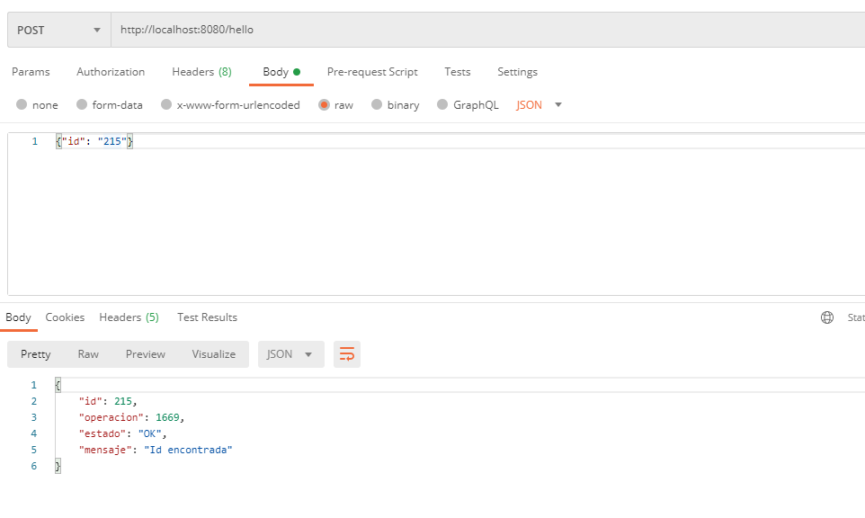
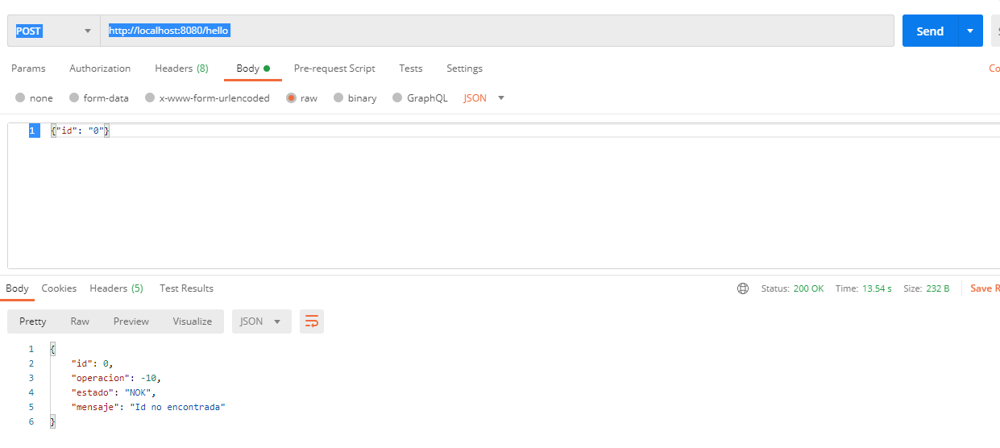

# Test Teletrabajo Sonda

### Documentación de uso

Es un WS realizado en Spring Boot que lee un archivo binario y lo parsea adecuadamente para poder obtener un número de registro y una operación según se solicitó.

Este ws esta hecho para recibir un Json con el registro solicitado y  respondiendo en formato Json el registro y su operación asociada, el cual fue sacado del archivo binario.

Para que la aplicación funciones se debe utilizar la herramienta SoalUI o Postman enviando los parámetros en formato Json recibiendo la respuesta en el mismo formato.

### Ejemplo envío exitoso

### Ejemplo número no contenido en el binario

